# AEGISTRACE: System Architecture & Technical Specification

> **SIH 2026 — Project ID: SIH26237**  
> **Post-Quantum Cryptographic Document Protection, Forensic Watermarking & Immutable Leak Attribution Platform**

---

## 1. Executive Summary & Design Principles

**AEGISTRACE** is an air-gapped sovereign defense and enterprise cybersecurity platform designed to eliminate the **"broadcast-encrypt, individually-decrypt"** security failure. In conventional document distribution, once a recipient decrypts a classified asset, all recipients hold byte-identical copies; if leaked via smartphone photo, screenshot, or lossy recompression, the culprit cannot be mathematically proven. Furthermore, impending cryptanalytic quantum computers will render classical public-key infrastructure (RSA, ECDSA) obsolete.

AEGISTRACE resolves this through five architectural pillars:
1. **Post-Quantum Confidentiality:** NIST FIPS 203 (ML-KEM-768) lattice-based key encapsulation mechanisms for per-recipient key wrapping.
2. **Dynamic Forensic Attribution:** Frequency-domain DWT-DCT spread-spectrum watermarking dynamically embedded into the image's luminance channel at the exact instant of recipient decryption.
3. **Cryptographic Non-Repudiation:** NIST FIPS 204 (ML-DSA-65) post-quantum digital signatures binding the decryption session to the recipient's private key.
4. **Byzantine Consensus Ledger:** A 4-node PBFT permissioned blockchain securing tamper-evident session commitments with Merkle tree inclusion proofs.
5. **100% Air-Gapped Operation:** Zero cloud dependencies, zero external telemetry, deployable entirely on isolated COTS hardware.

---

## 2. End-to-End Cryptographic Architecture

```mermaid
flowchart LR
    subgraph INGEST ["1. Master Ingestion"]
        Doc[Classified Asset] --> AES_Gen[CSPRNG 256-bit Key]
        AES_Gen --> GCM_Enc[AES-256-GCM Bulk Encrypt]
    end

    subgraph DISTRIB ["2. Post-Quantum Distribution"]
        GCM_Enc --> KEM_Wrap[NIST ML-KEM-768 Encapsulation]
        KEM_Wrap --> Env[Recipient Envelopes]
    end

    subgraph DECRYPT ["3. Decryption & Dynamic Marking"]
        Env --> KEM_Decap[ML-KEM-768 Decapsulation]
        KEM_Decap --> DWT_Mark[DWT-DCT Invisible Embedding]
    end

    subgraph CONSENSUS ["4. PBFT Blockchain"]
        DWT_Mark --> DSA_Sign[ML-DSA-65 Signature]
        DSA_Sign --> PBFT[4-Node Consensus Commit]
    end

    subgraph FORENSICS ["5. Leak Investigation"]
        PBFT -. Leaked Copy .-> DWT_Corr[2D-DWT Correlation Sweep]
        DWT_Corr --> Verdict[Court-Admissible Attribution]
    end
```



### 2.1 Cryptographic Primitives & Specifications
* **Bulk Data Encryption:** **AES-256-GCM** (NIST SP 800-38D) with a 96-bit random nonce and 128-bit authentication tag, ensuring authenticated confidentiality with zero-bit tamper detection.
* **Key Encapsulation (PQC KEM):** **ML-KEM-768** (NIST FIPS 203, Module-LWE, Security Category 3, 128-bit post-quantum security equivalent to AES-192). Employs hybrid dual-layer exchange with ephemeral X25519.
* **Digital Signatures (PQC DSA):** **ML-DSA-65** (NIST FIPS 204, Module-LWE, Category 3). Generates unforgeable post-quantum signature proofs over session parameters `(doc_id || recipient_id || watermark_id || nonce || timestamp)`.

---

## 3. Dynamic Forensic Watermarking Pipeline

Watermarking occurs **on-the-fly inside the recipient's verified session**, ensuring every recipient receives a visually imperceptible yet mathematically distinct asset.

$$\Delta Y(x, y) = \alpha \cdot P_{\text{spread}}(x, y) \cdot M_{\text{edge}}(x, y)$$

1. **Colorspace Decomposition:** The recovered RGB image is transformed to the $YC_bC_r$ colorspace. The human visual system (HVS) is least sensitive to subtle luminance fluctuations; hence, all embedding operates exclusively on the $Y$-channel.
2. **Frequency Sub-band Selection:** 2D Discrete Wavelet Transform (DWT) decomposes the image into four sub-bands ($LL, LH, HL, HH$). The payload is modulated across the $LL$ (Approximation) and $HL$ (Horizontal) sub-bands to resist low-pass blurring and JPEG quantization.
3. **Perceptual Edge Energy Masking ($M_{\text{edge}}$):** A $3\times3$ Sobel gradient filter calculates local edge energy $E = \sqrt{G_x^2 + G_y^2}$. Higher embedding strength is applied to high-texture regions, while smooth regions remain pristine.
4. **Geometric Synchronization Markers:** Subtle geometric fiducial pulses are embedded at four quadrant margins ($[24, 24]$, $[W-24, 24]$, $[24, H-24]$, $[W-24, H-24]$). These enable the forensic extractor to compute perspective homography transforms and rectify smartphone camera angles.
5. **Quality Assurance Gate:** Benchmarked performance guarantees **PSNR $\ge 44.5\text{ dB}$** and **SSIM $\ge 0.9998$**.

---

## 4. 4-Node PBFT Consensus Ledger Architecture

To prevent rogue privileged administrators from altering historical records, session commitments are submitted to a permissioned Practical Byzantine Fault Tolerance (PBFT) blockchain network across 4 independent custodian nodes:
* **Node 1 (IT Security Operations):** Primary validator and transaction proposer.
* **Node 2 (Compliance Directorate):** Regulatory policy enforcement and privacy custodian.
* **Node 3 (Independent Audit Office):** External oversight and hash-chain verifier.
* **Node 4 (Office of Legal Counsel):** Evidence custodian and non-repudiation registrar.

### Consensus Flow ($3f + 1$ Fault Tolerance):
$$\text{Quorum Threshold} = 2f + 1 = 3 \text{ of } 4 \text{ Nodes}$$

1. **Pre-Prepare:** Primary node proposes block containing Merkle root of transaction batch.
2. **Prepare:** Validators verify transactions, sign prepare messages, and broadcast across the peer-to-peer mesh.
3. **Commit:** Upon receiving $2f+1$ valid prepares, nodes commit the block to their immutable local SQLite datastores.
4. **Tamper Rejection:** Any unauthorized alteration of block data invalidates the cryptographic Merkle root and breaks the SHA-256 hash link ($\text{Hash}_N \neq \text{SHA256}(\text{Block}_N)$), immediately triggering an **`INTEGRITY BROKEN`** quarantine state across all surviving nodes.

---

## 5. Adversarial Attack Resilience & Forensic Extraction

The Attribution Engine extracts forensic watermarks from degraded or leaked copies without requiring the original un-watermarked document.

```
Leaked Document ──► Perspective Rectification ──► 5x5 Gaussian High-Pass ──► 2D Correlation Sweep ──► Z-Score & ML-DSA Proof
```

* **Adversarial Resilience:** Survives lossy JPEG compression down to Quality 15%, additive Gaussian sensor noise ($\sigma = 25$), 35% spatial border cropping, optical defocus blur, and smartphone screen photos (Moiré pattern filtering).
* **High-Pass Residual Isolation:** A $5\times5$ spatial Gaussian filter extracts the high-frequency watermark noise residual $\Delta Y = Y_{\text{rect}} - G(Y_{\text{rect}})$.
* **Normalized Cross-Correlation Sweep:** The extracted residual is correlated against registered deterministic spread patterns $P_i = \text{SHA256}(WM_i)$ for all enrolled recipients.
* **Statistical Attribution:** A match is verified when the correlation peak satisfies $Z\text{-score} > 1.5$ ($P < 0.001$), generating a cryptographically certified attribution report with verified ML-DSA-65 signatures.

---

## 6. Threat Model & Security Analysis

| Threat Scenario | Attack Mechanism | AEGISTRACE Defense |
| :--- | :--- | :--- |
| **"Store Now, Decrypt Later"** | Adversary intercepts ciphertexts to crack via quantum computers in 2030+ | **NIST FIPS 203 (ML-KEM-768)** lattice hardness provides provable post-quantum security |
| **Post-Decryption Insider Leak** | Authorized officer photos document with a smartphone and leaks online | **DWT-DCT forensic watermark** survives screen recapture and pinpoints officer ID |
| **Plausible Deniability** | Officer claims account was compromised or denies receiving document | **NIST FIPS 204 (ML-DSA-65)** signature binds hardware token to session non-repudiation |
| **Rogue Administrator Tampering** | Insider admin attempts to modify or delete logs to frame/protect someone | **4-Node PBFT Blockchain** with Merkle tree proofs detects and rejects state modification |
| **Network Eavesdropping** | Man-in-the-middle on internal distribution channels | **Isolated Recipient Envelopes** wrap symmetric keys individually; no cross-decryption |

---

*AEGISTRACE Architecture Document — SIH 2026 — Ministry of Defence & National Security Alignment*
