# AEGISTRACE: Post-Quantum Forensic Watermarking & Leak Attribution System

> **Smart India Hackathon 2026 | Project ID: SIH26237**  
> **Theme:** Cybersecurity & Defense Technology  
> **Architecture Reference:** [ARCHITECTURE.md](ARCHITECTURE.md) (Comprehensive 2-Page Technical Specification)

[](https://csrc.nist.gov/)
[]()
[]()
[-brightgreen.svg)]()

---

## 🔒 Executive Summary

In defense and intelligence operations, **82% of classified document leaks originate from authorized internal recipients post-decryption**—photographed from screens or compressed and shared on external networks. When documents are broadcast-encrypted to a group, every recipient capable of decrypting holds a byte-identical copy; if leaked, all recipients are equally plausible suspects, and static watermarks or server logs are easily contested or tampered with. Furthermore, impending cryptanalytic quantum computers will compromise classical RSA and ECC public-key cryptography.

**AEGISTRACE** solves this by uniting:
1. **NIST FIPS 203 (ML-KEM-768) + Hybrid X25519:** Quantum-safe per-recipient envelope key encapsulation.
2. **Dynamic Forensic Watermarking:** Invisible DWT-DCT spread-spectrum watermarking dynamically injected at the exact moment of recipient decryption (**PSNR > 44.5 dB**, **SSIM > 0.9998**).
3. **NIST FIPS 204 (ML-DSA-65):** Post-quantum digital signatures establishing legally binding non-repudiation per session.
4. **4-Node PBFT Permissioned Blockchain:** Byzantine Fault Tolerant distributed ledger ensuring tamper-proof audit trails with Merkle tree inclusion proofs.
5. **Adversarial Forensic Attribution Lab:** Frequency-domain correlation sweep isolating watermarks from degraded copies (surviving lossy JPEG, noise, cropping, and smartphone camera recapture).

---

## 🏗️ System Architecture & Workflow

```mermaid
flowchart LR
    A["1. Upload & Master Encrypt<br/>AES-256-GCM (256-bit Key)"] --> B["2. Post-Quantum Wrap<br/>NIST FIPS 203 ML-KEM-768"]
    B --> C["3. Recipient Decryption<br/>Hardware-bound Decapsulation"]
    C --> D["4. Dynamic Watermarking<br/>DWT-DCT Spread Spectrum (Y-Channel)"]
    D --> E["5. Non-Repudiation Signature<br/>NIST FIPS 204 ML-DSA-65"]
    E --> F["6. 4-Node PBFT Consensus<br/>Merkle Tree Block Commit"]
    F -. Leaked Document .-> G["7. Forensic Investigation Lab<br/>Adversarial Attacks / Camera Recapture"]
    G --> H["8. Court-Admissible Attribution<br/>Z-Score Confidence & Proof"]
```



For the complete in-depth mathematical specification, frequency sub-band mappings, and PBFT consensus mechanics, read the **[AEGISTRACE Architecture Document](ARCHITECTURE.md)**.

---

## 🚀 Key Features

* **Quantum-Resilient Key Encapsulation (ML-KEM-768):** Protects sensitive documents against "Store Now, Decrypt Later" state-sponsored surveillance.
* **Perceptually Imperceptible Watermarking:** Modulates luminance ($Y$) in the wavelet frequency domain ($LL$ and $HL$ sub-bands) using Sobel edge-energy masking—completely invisible to the human eye.
* **Camera Recapture Resilience:** 4-quadrant geometric fiducials enable homography un-warping to reverse perspective tilt and camera distortion from smartphone screen photos.
* **Attack Simulator & Pixel Heatmap Inspector:** Built-in lab to simulate JPEG compression, sensor noise, cropping, and screen recapture, complete with live $12\times$ amplified difference heatmaps.
* **Exact "HOW & WHERE" Attribution Evidence:** Highlights 2D-DWT frequency sub-bands, spatial fiducials, and step-by-step mathematical derivation showing how the leaker was identified.
* **4-Node PBFT Blockchain:** Multi-custodian consensus across IT Security, Compliance, Audit, and Legal nodes. Includes a live **Tamper Demo** showcasing instant cryptographic quarantine.
* **100% Air-Gapped & Sovereign:** Zero internet dependency, zero recurring licensing costs, runnable on standard commodity hardware.

---

## 🛠️ Tech Stack

| Layer | Technologies |
| :--- | :--- |
| **Backend API** | Python 3.10+, FastAPI (Asynchronous REST API), Uvicorn |
| **Post-Quantum Cryptography** | NIST FIPS 203 ML-KEM-768, NIST FIPS 204 ML-DSA-65, AES-256-GCM |
| **Signal Processing & Imaging** | 2D Discrete Wavelet Transform (DWT), DCT, OpenCV, NumPy, Pillow |
| **Consensus & Ledger** | 4-Node PBFT (Practical Byzantine Fault Tolerance) Mesh, Merkle Tree Proofs |
| **Database & Audit** | SQLite, SQLAlchemy ORM, SHA-256 Tamper-Evident Hash Chains |
| **Frontend UI** | React 18, Vite 8, Tailwind CSS v4 (AegisTrace Cyber Theme) |

---

## 💻 Step-by-Step Setup Instructions

### Prerequisites
* **Python 3.10+** (Tested on Python 3.12, 3.13, 3.14)
* **Node.js 18+** and `npm`
* Git

---

### 1. Clone the Repository
```bash
git clone https://github.com/vamshimohan-777/sih-2026.git
cd sih-2026
```

---

### 2. Backend Setup
1. **Create and activate a virtual environment (recommended):**
   ```bash
   # Windows (PowerShell):
   python -m venv venv
   .\venv\Scripts\Activate.ps1

   # Linux / macOS:
   python3 -m venv venv
   source venv/bin/activate
   ```

2. **Install Python dependencies:**
   ```bash
   pip install -r requirements.txt
   ```

3. **Start the FastAPI Backend Server:**
   ```bash
   python -m uvicorn backend.app.main:app --host 127.0.0.1 --port 8000
   ```
   * The backend will automatically initialize the SQLite database, seed default users, provision lattice keys, and load sample classified documents.
   * Swagger Documentation is available at: **[http://127.0.0.1:8000/api/docs](http://127.0.0.1:8000/api/docs)**

---

### 3. Frontend Setup
1. **Open a new terminal and navigate to `frontend`:**
   ```bash
   cd frontend
   npm install
   ```

2. **Start the Vite development server:**
   ```bash
   npm run dev -- --host
   ```
   * Open your browser to: **[http://localhost:5173](http://localhost:5173)**

---

## 🔑 Default User Credentials

| Role | Username | Password | Accessible Capabilities |
| :--- | :--- | :--- | :--- |
| **SuperAdmin** | `superadmin1` | `SuperAdmin@123` | PBFT Blockchain Ledger, Full Audit Hash Chain, User Management, Sessions Distribution Registry |
| **Admin** | `admin1` | `Admin@123` | Document Repository, ML-KEM Distribution Wizard, Attack Simulator, Forensic Leak Attribution |
| **User** | `user1` | `User1@123` | Enrolled Package Decryption, Side-by-Side Watermark Inspector, Secure Download |
| **User (Extra)** | `user2` | `User2@123` | Secondary test recipient with distinct ML-KEM-768 & ML-DSA-65 lattice keypairs |

---

## 🧪 Interactive Demo Walkthrough

1. **Login as Admin (`admin1` / `Admin@123`):**
   * Navigate to **Documents** ➔ Click **DISTRIBUTE** on a classified directive.
   * Select `user1` and `user2` ➔ Click **Distribute to 2 Recipients**.
   * Observe the live animated terminal executing AES-256 encryption and ML-KEM-768 lattice key wrapping.
2. **Login as User (`user1` / `User1@123`):**
   * Go to **Documents** ➔ Click **DECRYPT**.
   * Note the enforced identity chip: `DECRYPTING AS: user1 | USER`.
   * Click **INITIATE DECRYPTION SEQUENCE**:
     * View the recovered document, amplified difference heatmap, and live metrics (**PSNR > 44.5 dB**, **SSIM > 0.9998**).
     * Click **↓ Download Watermarked Document**.
3. **Investigate Leak in Forensic Lab (`admin1`):**
   * Go to **Forensic Lab** ➔ Select user1's session in the **Attack Simulator**.
   * Apply a **JPEG Compress** or **Recapture** attack at 60-70% intensity.
   * Click **🔍 Compare Image Differences & Pixel Heatmap** to inspect altered pixels.
   * Click **→ Send Attacked Image to Attribution Engine**.
   * Click **RUN FORENSIC EXTRACTION**:
     * Watch the DWT correlation sweep isolate the watermark.
     * **Result:** `⚠ LEAK ATTRIBUTED: user1` with >95% confidence, verified ML-DSA-65 signature, and PBFT 4/4 consensus.
     * Explore the **WHERE Found** (wavelet sub-band matrix) and **HOW Extracted** (mathematical proof) tabs!
4. **Inspect Ledger Integrity as SuperAdmin (`superadmin1`):**
   * Navigate to **Ledger Explorer** to inspect the vertical PBFT blockchain blocks.
   * Click **TAMPER DEMO** ➔ See the red **`INTEGRITY BROKEN`** quarantine banner.
   * Click **RESTORE** ➔ Consensus verifies and restores the blockchain state.

---

## 📜 Alignment with National Initiatives

AEGISTRACE is built in alignment with:
* **India's National Quantum Mission (NQM):** Transitioning critical infrastructure to post-quantum cryptographic standards (NIST FIPS 203/204).
* **Atmanirbhar Bharat:** 100% indigenous architecture without reliance on proprietary foreign cybersecurity software.
* **Air-Gapped Sovereign Readiness:** Purpose-built for isolated military commands, DRDO laboratories, and intelligence divisions.

