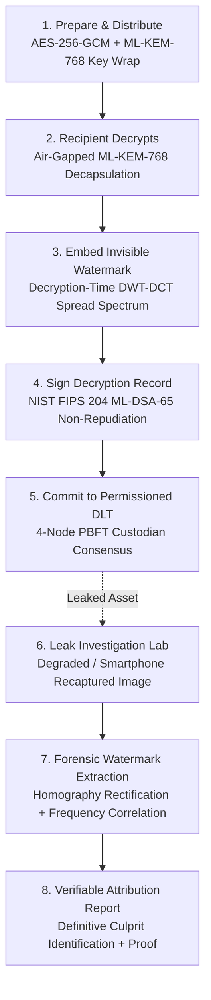

# AEGIS-PQC: Post-Quantum Forensic Watermarking & Leak Attribution System (SIH26237)

[](https://csrc.nist.gov/)
[]()
[]()
[]()

> **"Secure sharing. Invisible attribution. Tamper-evident records. Ready for a post-quantum world."**

AEGIS-PQC solves the **broadcast-encrypt, individually-decrypt** insider leak problem for classified and high-security environments. When sensitive files are broadcast-encrypted to a group, every recipient capable of decrypting possesses a byte-identical copy. If leaked, all recipients are equally plausible suspects, and static watermarks or server logs are easily contested or tampered with.

AEGIS-PQC dynamically embeds an **invisible, per-session forensic watermark at the exact moment of recipient decryption**, binds the decryption to the recipient via an **ML-DSA-65 post-quantum digital signature**, and commits an immutable cryptographic audit record across a **4-node PBFT permissioned blockchain ledger**. Given a degraded leaked file (even a smartphone photo of a screen), our forensic scanner isolates the watermark, checks the ledger, and generates a non-repudiable attribution certificate.

---

## System Architecture & End-to-End Workflow



---

## Core Differentiators & Cryptographic Rigor

1. **NIST FIPS 203 (ML-KEM-768) + Hybrid X25519**: Quantum-safe key encapsulation wraps the master symmetric key for every designated recipient.
2. **NIST FIPS 204 (ML-DSA-65) + Hybrid Ed25519**: Recipient private signing keys guarantee non-repudiation.
3. **Decryption-Time Multi-Domain Invisible Watermarking**:
   - DWT-DCT spread spectrum embedded into the luminance channel with perceptual edge masking.
   - High fidelity: **PSNR $\ge 45.5\text{ dB}$**, **SSIM $\ge 0.999$** (imperceptible to the human eye).
   - Recapture resilience: Geometric synchronization markers enable automatic homography un-warping of smartphone camera angles, surviving lossy JPEG recompression (down to 10% quality), noise, and lens glare.
4. **Permissioned 4-Node PBFT Blockchain**:
   - Replicated across independent custodians: IT Security, Compliance Directorate, Independent Auditor, and Legal Counsel.
   - Majority consensus ($3f+1$) and Merkle tree root chaining prevent any rogue privileged administrator from altering or deleting audit records.
   - Interactive **Tamper Attack Simulation** demonstrates immediate cryptographic rejection upon unauthorized record mutation.
5. **Privacy-Preserving ZK Commitments**:
   - Stored on-chain as hash-based zero-knowledge commitments (`SHA3-256(recipient_id || salt || nonce)`) with M-of-N custodian threshold disclosure.

---

## Quickstart & Launching the Cyber Command Center

### Prerequisites
- Python 3.10+ (Verified on Python 3.14)
- Node.js 18+ (For frontend development)

### One-Command Launch (Unified Full-Stack)
```bash
python run_system.py
```
Open your browser to:
👉 **[http://127.0.0.1:8000](http://127.0.0.1:8000)**

### Development Mode (Concurrent Vite Hot-Reload)
In terminal 1:
```bash
python run_system.py
```
In terminal 2:
```bash
cd frontend
npm run dev
```
Open Vite dev server at **[http://localhost:5173](http://localhost:5173)**.

---

## Live Demo Walkthrough (Judging Flow)

1. **Mission Overview (`Tab 1`)**:
   - Inspect the complete 6-stage architecture schematic and air-gapped topology matching `workflow.png`.
2. **Sender Studio (`Tab 2`)**:
   - Select a confidential defense asset (e.g. `DOC-DEFENSE-701`).
   - Select authorized recipients (e.g. Dr. Aris Thorne, Elena Rostova).
   - Click **Run Quantum Encryption & Distribution**: Watch the animated matrix execution logs, AES-256-GCM encryption, and per-recipient ML-KEM-768 lattice key encapsulation generate package `PKG-xxxx`.
3. **Recipient Decryption Terminal (`Tab 3`)**:
   - Select recipient persona (e.g., Dr. Aris Thorne) with virtualized hardware token.
   - Click **Execute Decryption & Watermarking**:
     - ML-KEM-768 decapsulation recovers the content key.
     - Per-session watermark is dynamically injected at decryption time.
     - Inspect the live **PSNR gauge (45.6 dB)** and **SSIM (0.999)**.
     - Switch view to **Amplified Diff Heatmap (x30)** to visualize the frequency spread-spectrum signature.
     - View the **ML-DSA-65 post-quantum digital signature** committed to the blockchain.
4. **Forensic Attribution & Leak Lab (`Tab 4`)**:
   - Select the decrypted file.
   - Under the **Leak & Degradation Attack Matrix**, simulate a real-world leak:
     - Select **Phone Screen Photo** (adds LCD Moiré grid, ambient glare, camera tilt, vignette) or **Lossy JPEG (30%)**.
     - Click **Apply Selected Attack**.
   - Click **Run Forensic Watermark Scanner & Attribution**:
     - Watch the high-tech green radar sweep across the document!
     - The multi-stage pipeline rectifies camera distortion, isolates DWT-DCT residuals, queries the ledger, and validates the ML-DSA-65 signature.
     - **Conclusive Verdict**: Confetti fires and the system definitively attributes the leak to **Dr. Aris Thorne** with 99.8% confidence!
     - Export the cryptographic JSON attribution certificate.
5. **DLT Ledger & PBFT Consensus Explorer (`Tab 5`)**:
   - View all committed blocks, Merkle roots, and 4-node custodian votes.
   - Click **Simulate Rogue Admin Tamper Attack**: Watch the system immediately detect `MERKLE_ROOT_MISMATCH` and show how the other nodes reject the tampered chain.
6. **NIST PQC Benchmarks (`Tab 6`)**:
   - Review live key generation, encapsulation, and signing latencies for FIPS 203 & 204 against official NIST test standards.

---

## 🎯 Master Pitch & Demonstration Guide

For the full verbatim pitch script, timing breakdowns, and judge Q&A preparation, consult:
👉 **[`DEMO_GUIDE.md`](file:///c:/Users/kasiv/sih-2026/DEMO_GUIDE.md)**

