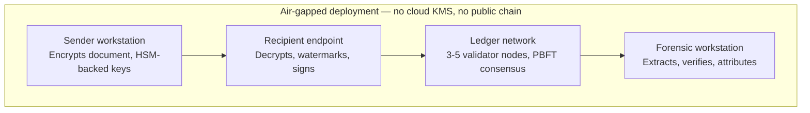
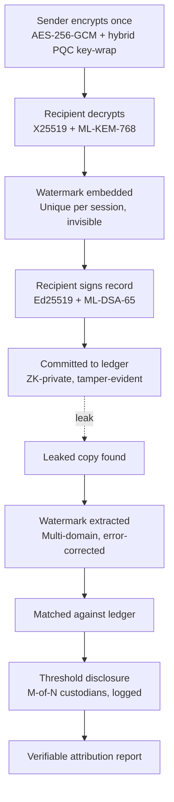

# SIH26237 — Post-Quantum Forensic Watermarking & Leak Attribution System

## Table of contents

1. [Problem statement](#1-problem-statement)
2. [Solution overview](#2-solution-overview)
3. [Requirements breakdown](#3-requirements-breakdown)
4. [System architecture](#4-system-architecture)
5. [End-to-end workflow](#5-end-to-end-workflow)
6. [Novel features](#6-novel-features)
7. [Technology stack](#7-technology-stack)
8. [Public datasets & validation resources](#8-public-datasets--validation-resources)
9. [Build plan](#9-build-plan-36-hour-phased-approach)
10. [Requirement traceability](#10-requirement-traceability)
11. [Risks & pitfalls to avoid](#11-risks--pitfalls-to-avoid)

---

## 1. Problem statement

Sensitive documents are typically distributed under a **broadcast-encrypt, individually-decrypt** model: the sender encrypts a file once, and every recipient decrypts it independently with their own credentials. When the file is shared with a single person, a leak is trivially attributable. When it's shared with a *group*, every recipient capable of decrypting it becomes an equally plausible suspect, because the decrypted content is byte-identical across all of them and carries no trace of which decryption produced the leaked copy.

Existing safeguards don't solve this:
- **Server-side access logs** can be altered by a privileged administrator.
- **Static watermarks applied before distribution** are identical for every recipient, which just reproduces the same attribution problem.

**Goal:** a system that stamps a unique, invisible forensic watermark into a document *at the moment of decryption*, specific to each recipient's session, so every decrypted copy is visually identical but forensically distinct. Each decryption event is cryptographically bound to the recipient's identity via a signature made with their own private key (non-repudiation), and that signed record is committed to an immutable, tamper-evident ledger that no single administrator can alter. Given a leaked copy, the system extracts the watermark, looks it up against the ledger, and returns a cryptographically verifiable record of exactly who decrypted it and when.

**Hard constraints from the problem statement:**
- NIST-standardized post-quantum algorithms for Key Exchange and Digital Signatures — not classical RSA/ECDSA as the primary scheme.
- Immutable audit layer implemented with blockchain / Distributed Ledger Technology (DLT).
- Full operation within an **offline, air-gapped** environment.
- **No** dependency on external cloud KMS services.
- **No** dependency on public blockchain networks.

---

## 2. Solution overview

The system has three tightly coupled subsystems:

1. **Broadcast-encrypt / individual-decrypt layer** — the sender encrypts the document once with a symmetric content key, then wraps that key separately for each recipient using a NIST post-quantum KEM.
2. **Recipient-side watermark + non-repudiation** — the instant a recipient's device decrypts the document, it embeds an invisible per-session watermark and signs a decryption record with the recipient's own post-quantum private key, so they cannot later deny having opened it.
3. **Tamper-evident ledger + forensic lookup** — the signed record is committed to a permissioned DLT replicated across multiple independent custodian nodes. Given a leaked file, the watermark is extracted, matched against the ledger, and the signature chain is re-verified to produce a verifiable attribution report.

---

## 3. Requirements breakdown

| Requirement (from the PS) | What it actually means | Where it's handled |
|---|---|---|
| Unique, invisible watermark at decryption time | Client-side embedding, not server-side or pre-distribution | Recipient client — watermark engine |
| Specific to recipient + session | Watermark payload = recipient ID + session nonce + timestamp | Session watermark generator |
| Visually identical, forensically distinct | Imperceptible embedding, quantitatively validated (PSNR/SSIM) | Multi-domain robust embedding |
| Cryptographic binding to recipient identity | Signature over the decryption record | Hybrid signing (recipient's own key) |
| Signature from recipient's own private key | Non-repudiation — only the recipient could have produced it | Local HSM / token-held keys |
| NIST PQC for Key Exchange and Signatures | ML-KEM (FIPS 203) and ML-DSA (FIPS 204), not RSA/ECDSA alone | Hybrid crypto layer |
| Immutable audit layer via blockchain/DLT | Permissioned ledger, not a simple database | Ledger network (3–5 validator nodes) |
| No single admin can alter records | Requires majority collusion across independent custodians | Multi-node consensus + Merkle chaining |
| Extract watermark from a leaked file | Must work on degraded copies (screenshots, recompression) | Forensic extraction module |
| Look up watermark against the ledger | Deterministic ID → ledger record mapping | Ledger lookup service |
| Verifiable record identifying the recipient | Independently re-checkable, not "trust our server" | Signed attribution report |
| Fully offline / air-gapped | Zero calls to the public internet anywhere in the pipeline | Deployment topology, Section 4 |
| No cloud KMS | Private keys never leave local hardware | Local PKCS#11 HSM / smart cards |
| No public blockchain | Consortium of internally-owned nodes only | Permissioned DLT (e.g. Hyperledger Fabric) |

---

## 4. System architecture

Every component runs on-premises across a small number of physically distinct machines connected only over a local network or by hand-carried media between sites — nothing in the design ever needs to reach the public internet.

### Component responsibilities

| Zone | Component | Responsibility |
|---|---|---|
| Sender workstation | Encryption engine | AES-256-GCM content encryption, per-recipient hybrid PQC key wrap |
| Recipient endpoint | Decapsulation module | Recovers the content key with the recipient's private key |
| Recipient endpoint | Watermark engine | Generates and embeds the unique per-session mark |
| Recipient endpoint | Signer | Produces the non-repudiable, hybrid-signed decryption record |
| Ledger network | Validator nodes (×3–5) | Independent custodians (IT, compliance, registrar, external auditor) who must reach consensus to commit or would need to collude to tamper |
| Ledger network | ZK commitment layer | Stores identity as a privacy-preserving commitment, not raw PII |
| Forensic workstation | Extraction + verification | Recovers the watermark from a leaked file, matches it to a ledger entry, verifies the full proof chain, and issues a signed attribution report |

---

## 5. End-to-end workflow

**Step-by-step:**

1. The sender encrypts the document once and wraps the content key separately for each recipient using a hybrid classical + post-quantum KEM.
2. An authorized recipient decrypts the document on their own device, using their private key.
3. The system generates a unique invisible forensic watermark, tied to that recipient and that decryption session, and embeds it before the document is ever rendered or saved.
4. The recipient's device signs a decryption record (document hash, recipient ID, watermark ID, timestamp) with their own post-quantum private signing key.
5. The signed record is committed to the offline, tamper-evident ledger, as a zero-knowledge–wrapped commitment rather than raw identity data.
6. The recipient ends up with a copy that looks identical to everyone else's, but is uniquely fingerprinted.
7. If the document leaks, the watermark is extracted from the leaked copy — even a degraded one.
8. The extracted watermark is matched against the ledger.
9. A quorum of authorized custodians jointly discloses the identity behind the commitment; that disclosure request is itself logged.
10. The system produces a cryptographically verifiable attribution report, independently re-checkable by a third party.

---

## 6. Novel features

These are the differentiators worth demonstrating deeply rather than spreading thin:

1. **Recapture-resistant, multi-domain watermarking.** Most real leaks aren't clean digital copies — they're a phone photo of a screen. Embedding the watermark redundantly across the frequency domain (DWT-DCT-SVD hybrid), the text glyph layer, and a geometric synchronization pattern lets extraction survive rotation, cropping, recompression, and print-scan-recapture — the same class of technique used in cinema forensic watermarking.
2. **Hybrid classical + post-quantum cryptography.** Combining X25519 with ML-KEM-768 for key exchange, and Ed25519 with ML-DSA-65 for signatures, mirrors real-world PQC transition practice (TLS 1.3 hybrid groups, Chrome/Cloudflare's hybrid key exchange) — defense-in-depth rather than betting everything on a cryptographically young PQC scheme.
3. **Privacy-preserving ledger via zero-knowledge commitments.** The ledger stores a hash-based ZK-STARK commitment of the recipient's identity rather than raw PII — so nobody with mere read access, including internal admins, can browse "who has document X." Identity only resolves through **M-of-N threshold disclosure** by independent custodians, and each disclosure request is itself logged — auditing the investigators, not just the recipients. STARKs (hash-based) are used instead of SNARKs (elliptic-curve-based) to stay consistent with the post-quantum theme.
4. **Sneakernet-syncable multi-site ledger.** For genuinely separated air-gapped facilities, ledger blocks are exported as signed Merkle-batches onto removable media (or a one-way data diode) and imported at other sites, with periodic cross-signed checkpoint reconciliation — so "no public blockchain, fully air-gapped" doesn't quietly collapse into a single-node toy demo.
5. **(Optional stretch) Risk-weighted watermark strength.** A behavioral risk-scoring module (in the style of CERT insider-threat research) could flag higher-risk recipients and trigger a stronger, more redundant watermark for their copy — a defensible extension beyond the PS's explicit requirements if time allows.

---

## 7. Technology stack

| Layer | Component | Suggested technology | Why |
|---|---|---|---|
| Sender | Content encryption | AES-256-GCM | Fast, authenticated, standard for bulk data |
| Sender | Key wrap | X25519 + ML-KEM-768 (hybrid) | PQC via NIST FIPS 203, classical fallback during the transition period |
| Recipient | Watermark embed | DWT-DCT-SVD (images) + zero-width Unicode / glyph micro-shift (text) + Reed–Solomon coding | Survives compression, cropping, and recapture; error-correction recovers the ID from a noisy copy |
| Recipient | Signing | Ed25519 + ML-DSA-65 (hybrid) | Non-repudiation, both classically and PQ-proven today (FIPS 204) |
| Key custody | HSM / token | Local PKCS#11 HSM or smart cards (e.g. YubiHSM, SoftHSM for prototyping) | No cloud KMS dependency, keys never leave hardware |
| Ledger | Consensus | Hyperledger Fabric, or a hand-rolled Raft/PBFT log for a hackathon timeline | Permissioned, no public chain, majority collusion required to tamper |
| Ledger | Privacy | ZK-STARK commitment of recipient identity | Hash-based, so it stays post-quantum-safe unlike SNARK curves |
| Multi-site | Sync | Signed Merkle-batch export/import over removable media or a data diode | Keeps geographically separate air-gapped sites consistent, zero network dependency |
| Forensics | Extraction + report | OpenCV / pywt for extraction, a signed JSON/PDF certificate for output | Self-contained verification — no need to trust the server's word |

---

## 8. Public datasets & validation resources

This project is a systems/crypto build, not an ML training task, so there's no single "training dataset." These are the public resources worth pulling in for demo material and validation:

| Purpose | Resource | Link |
|---|---|---|
| Realistic sample documents for the demo | Enron Email Dataset (CALO Project, CMU) — ~0.5M real internal corporate emails | https://www.cs.cmu.edu/~enron/ |
| Watermark robustness benchmarking | USC-SIPI Image Database — the field-standard test images (Lena, Baboon, Peppers, etc.) | http://sipi.usc.edu/database/ |
| Steganalysis / undetectability benchmarking | BOSSbase — standard dataset for proving a watermark resists statistical steganalysis | http://agents.fel.cvut.cz/boss/ |
| Validating the PQC implementation | NIST ACVP-Server — official byte-exact Known-Answer-Test vectors for ML-KEM / ML-DSA (FIPS 203/204) | https://github.com/usnistgov/ACVP-Server/tree/master/gen-val/json-files |
| Optional bonus: risk-scoring tie-in | CERT Insider Threat Dataset (Carnegie Mellon SEI) — synthetic org logs with labeled leak/exfiltration behavior | search "CMU CERT Insider Threat dataset" |

A "100% KAT pass" slide, showing your ML-KEM/ML-DSA implementation reproduces NIST's official test vectors byte-for-byte, is a strong, concrete credibility signal — the same validation real FIPS 140-3 modules go through.

---

## 9. Build plan (36-hour phased approach)

### Phase 1 — Core pipeline (must work end-to-end)
Pick a single file type (PDF or images — most mature tooling) and take it all the way from encryption to forensic attribution, even crudely:
- ML-KEM-768 for key wrap, AES-256-GCM for the document (liboqs / liboqs-python)
- One robust watermarking method for the chosen file type
- ML-DSA-65 signing of the decryption record
- A simple hash-chained ledger replicated across 3+ local nodes (Hyperledger Fabric if time allows, else a signed append-only log with Raft/PBFT-style multi-node consensus)
- A CLI or small tool that takes a "leaked" file and outputs the attributed recipient

### Phase 2 — Pick one differentiator, go deep
Don't parallelize novelty — one convincing, demoable stand-out feature beats five shallow ones:
- Screenshot / print-scan-resistant watermark (biggest "wow" if it survives a phone photo), **or**
- Hybrid PQC + classical key exchange with a clear before/after explanation, **or**
- ZK-based privacy-preserving ledger commitment

### Phase 3 — Demo polish
- Encrypt one sample sensitive PDF, "distribute" to 3 simulated recipients
- Have recipient #2 "leak" it (forward it, or literally photograph the screen)
- Run extraction live on stage, show the ledger record and the signed attribution report
- Record a backup video — venues have flaky networks/hardware

---

## 10. Requirement traceability

Mapping every explicit bullet from the PS to where it's demoed — useful as a judging-panel checklist slide.

| PS requirement | Feature demonstrated |
|---|---|
| Generate a unique, invisible forensic watermark at decryption | Recipient watermark engine (Section 5, step 3) |
| Specific to recipient and decryption session | Session watermark generator: recipient ID + nonce + timestamp |
| Visually identical, forensically distinct | Multi-domain embedding, validated with PSNR/SSIM |
| Cryptographically bind decryption to recipient identity | Hybrid signing of the decryption record |
| Signature from recipient's own private key | Ed25519 + ML-DSA-65, key held in local HSM/token |
| NIST-standardized PQC for Key Exchange and Signatures | ML-KEM-768 (FIPS 203) + ML-DSA-65 (FIPS 204), hybridized |
| Immutable audit layer via blockchain/DLT | Permissioned ledger network, Section 4 |
| No single admin can alter records | 3–5 independent validator nodes, consensus required |
| Extract watermark from a leaked document | Forensic extraction module, error-corrected recovery |
| Look up watermark against the ledger | Ledger lookup service |
| Verifiable record identifying the recipient | Threshold-disclosed, signed attribution report |
| Fully offline / air-gapped operation | Deployment topology, Section 4 |
| No dependency on cloud KMS | Local PKCS#11 HSM / smart cards |
| No dependency on public blockchain networks | Permissioned DLT, internally-owned nodes only |

---

## 11. Risks & pitfalls to avoid

- **Fake post-quantum crypto.** Using RSA/ECDSA and calling it "quantum-safe" is a hard fail against this PS — it must genuinely be ML-KEM (FIPS 203) and ML-DSA/SLH-DSA (FIPS 204/205).
- **Public blockchain.** Deploying on Ethereum/Polygon testnets directly violates the "no public blockchain networks" constraint.
- **Cloud KMS.** Calling AWS KMS / Azure Key Vault violates both the "no cloud KMS" constraint and the air-gapped requirement.
- **Identical watermark for every recipient.** Misses the entire point of the problem statement — the watermark must be invisible *and* unique per session.
- **Single-node "blockchain."** A one-node demo doesn't actually demonstrate "no single admin can tamper" — use at least 3 independent nodes with real consensus.
- **Over-polishing UI at the expense of the crypto-forensic pipeline.** Judges on a cybersecurity PS will drill into crypto correctness; a working pipeline with a plain UI beats a beautiful UI wrapping a broken pipeline.
